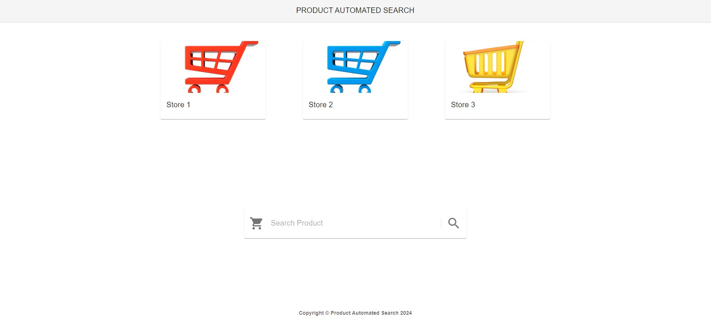

# Product Automated Search

This project is a web application that allows users to search for products across various online stores in an automated manner.

## User Interface

## Features

- Users can input the name of a product to search for.
- The application automatically searches for the product across different online stores.
- It displays the best products based on the search results, showing the products with their prices, ratings, and images. The user can also see all products that was searched by the app.

## Technologies Used

- **Frontend**: React.js
- **Backend**: Flask, python
- **Libraries**: Axios, Material-UI, dotenv, Selenium
